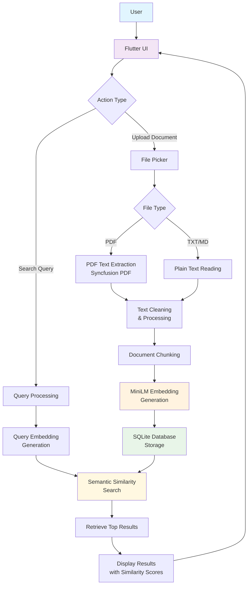

# MiniLM RAG System - Offline Medical Survival Guide for Gaza/Palestine

⚠️ **ALPHA VERSION - WORK IN PROGRESS** ⚠️

**This is an early alpha stage application. Some functions may not work properly:**
- PDF text extraction may produce garbled/corrupted text
- Document processing reliability varies
- UI elements may have inconsistent behavior
- Search accuracy is still being optimized

**Use with caution in critical situations. Always verify extracted information.**

---

🚀 **A Flutter-based Retrieval-Augmented Generation (RAG) system powered by MiniLM embeddings for intelligent document search and question answering, specifically designed for medical war/trauma survival in Gaza/Palestine with complete offline functionality.**

## 📋 Table of Contents

- [Features](#features)
- [Prerequisites](#prerequisites)
- [Installation](#installation)
- [Usage](#usage)
- [Architecture](#architecture)
- [Development](#development)
- [Contributing](#contributing)
- [License](#license)

## ✨ Features

- **🏥 Medical Focus**: Specialized for war/trauma medical survival in Gaza/Palestine
- **📄 Document Upload**: Support for medical PDF and text file uploads
- **🔍 Semantic Search**: Advanced semantic similarity search using MiniLM embeddings for medical information
- **🧠 Smart Chunking**: Intelligent text chunking with medical section title extraction
- **📊 Relevance Scoring**: Keyword-based result filtering and re-ranking for medical terms
- **🗃️ Persistent Storage**: SQLite database with Drift ORM for offline medical data
- **🧹 Data Cleaning**: Built-in corrupted document detection and cleanup
- **📱 Cross-Platform**: Runs on Android, iOS, and Web - critical for conflict zones
- **⚡ Real-time Search**: Instant search results with similarity scoring
- **🚨 Emergency Ready**: Designed for use in areas with limited connectivity
- **⚡ Offline Operation**: Complete functionality without internet connection

## ⚠️ Development Status

**Current Version**: Alpha 0.1.0 (Work in Progress)

### Known Issues
- **PDF Processing**: Text extraction from PDFs may result in garbled or corrupted text
- **Document Parsing**: Some document formats may not parse correctly
- **Search Accuracy**: Semantic search results may vary in quality
- **UI Stability**: Some interface elements may behave inconsistently
- **Performance**: Large documents may cause slow processing

### What Works
- ✅ Basic document upload (TXT files work best)
- ✅ Text chunking and embedding generation
- ✅ Semantic search functionality
- ✅ Local database storage
- ✅ Cross-platform deployment

### Upcoming Improvements
- 🔄 Enhanced PDF text extraction
- 🔄 Better error handling and user feedback
- 🔄 Improved search accuracy
- 🔄 UI/UX refinements
- 🔄 Performance optimizations

## 🏥 Medical Emergency Context

This RAG system is specifically designed to provide **offline access to critical medical information** for war/trauma survival situations in Gaza/Palestine. The system enables:

- **Emergency Medical Procedures**: Quick access to trauma care protocols
- **Drug Information**: Medication dosages and contraindications
- **Surgical Procedures**: Step-by-step emergency surgical guides
- **Wound Care**: Treatment protocols for various injury types
- **Resource Management**: Medical supply usage and alternatives
- **Triage Protocols**: Patient prioritization in mass casualty events

### Why Offline?
In conflict zones like Gaza/Palestine, internet connectivity is often:
- Intermittent or completely unavailable
- Unreliable during emergencies
- Potentially monitored or restricted

This system ensures **life-saving medical information remains accessible** regardless of connectivity status.

## 🔧 Prerequisites

Before you begin, ensure you have the following installed:

- **Flutter SDK** (3.32.7 or later)
- **Dart SDK** (3.8.1 or later)
- **Android Studio** or **VS Code** with Flutter extensions
- **Git**

### Platform-specific requirements:

#### Android
- Android SDK (API level 21 or higher)
- Android emulator or physical device

#### iOS (macOS only)
- Xcode 12.0 or later
- iOS Simulator or physical device

## 🚀 Installation

### 1. Clone the Repository

```bash
git clone https://github.com/yourusername/flutter-minilm-rag.git
cd flutter-minilm-rag
```

### 2. Install Dependencies

```bash
flutter pub get
```

### 3. Generate Database Code

```bash
dart run build_runner build
```

### 4. Download ML Models

The app requires MiniLM embedding models. Run the model download script:

#### Windows:
```bash
cd android/MiniLMEmbedder
.\download_models.bat
```

#### macOS/Linux:
```bash
cd android/MiniLMEmbedder
./download_models.sh
```

### 5. Run the Application

```bash
flutter run
```

## 📖 Usage

### Medical Document Upload
1. Launch the application
2. Tap the **"Upload Document"** button
3. Select medical PDFs or text files (trauma protocols, drug guides, surgical manuals)
4. Wait for processing to complete

### Emergency Medical Search
1. Enter medical queries in the search bar:
   - "gunshot wound treatment"
   - "severe bleeding control"
   - "emergency amputation procedure"
   - "shock management protocol"
2. View results with relevance scores
3. Tap on results to see detailed medical procedures
4. Use specific medical keywords for better results

### Example Medical Queries
- **Trauma**: "penetrating chest wound", "abdominal trauma", "head injury assessment"
- **Emergency Procedures**: "emergency tracheostomy", "chest tube insertion", "tourniquet application"
- **Medications**: "morphine dosage", "antibiotic selection", "pain management"
- **Triage**: "mass casualty triage", "priority assessment", "resource allocation"

### Search Tips

- **Use natural language**: "How to stop bleeding" works better than "bleeding stop"
- **Be specific**: "Emergency wound care" vs "wound"
- **Action-oriented queries**: The system prioritizes actionable content

### Document Management

- **View Documents**: See all uploaded documents with metadata
- **Delete Documents**: Remove documents and their associated chunks
- **Clean Corrupted Data**: Use the cleanup tool to remove garbled text

## ⚠️ Medical Disclaimer

**IMPORTANT**: This system is designed as an **emergency reference tool** for medical professionals and trained personnel in conflict zones. It is NOT a substitute for:
- Proper medical training
- Professional medical judgment
- Established medical protocols
- Emergency medical services when available

**Use only when conventional medical resources are unavailable. Always prioritize professional medical care when accessible.**

## 🏗️ Architecture

### Core Components

```
├── lib/
│   ├── database/           # Database schema and operations
│   │   ├── database.dart   # Main database class
│   │   ├── tables.dart     # Table definitions
│   │   └── database.g.dart # Generated code
│   ├── services/           # Business logic
│   │   └── embedding_service.dart
│   ├── screens/            # UI screens
│   │   └── rag_home_screen.dart
│   └── widgets/            # Reusable UI components
│       ├── document_upload_widget.dart
│       └── search_results_widget.dart
```

### Technology Stack

- **Frontend**: Flutter/Dart
- **Database**: SQLite with Drift ORM
- **ML Backend**: MiniLM embeddings (Rust/Kotlin)
- **File Processing**: Syncfusion PDF, native file picker
- **State Management**: StatefulWidget with local state

### Data Flow

1. **Document Upload** → Text Extraction → Chunking → Embedding Generation → Database Storage
2. **Search Query** → Embedding Generation → Similarity Calculation → Keyword Filtering → Results

## 🛠️ Development

### Project Structure

```
flutter_minilm_app/
├── android/                # Android-specific code
│   └── MiniLMEmbedder/    # Kotlin ML integration
├── lib/                   # Flutter application code
├── test/                  # Unit and widget tests
├── pubspec.yaml          # Dependencies
└── README.md             # This file
```

### Building for Release

#### Android APK
```bash
flutter build apk --release
```

#### Android App Bundle
```bash
flutter build appbundle --release
```

#### iOS
```bash
flutter build ios --release
```

#### Web
```bash
flutter build web --release
```

### Running Tests

```bash
# Run all tests
flutter test

# Run with coverage
flutter test --coverage
```

### Code Generation

When modifying database schemas:

```bash
dart run build_runner build --delete-conflicting-outputs
```

## 🤝 Contributing

1. Fork the repository
2. Create a feature branch (`git checkout -b feature/amazing-feature`)
3. Commit your changes (`git commit -m 'Add amazing feature'`)
4. Push to the branch (`git push origin feature/amazing-feature`)
5. Open a Pull Request

### Development Guidelines

- Follow [Flutter style guide](https://dart.dev/guides/language/effective-dart/style)
- Write tests for new features
- Update documentation for API changes
- Ensure all tests pass before submitting PR

## 📝 License

This project is licensed under the MIT License - see the [LICENSE](LICENSE) file for details.

## 🙏 Acknowledgments

- [MiniLM](https://huggingface.co/sentence-transformers/all-MiniLM-L6-v2) for embeddings
- [Drift](https://drift.simonbinder.eu/) for database ORM
- [Syncfusion](https://www.syncfusion.com/flutter-widgets) for PDF processing
- Flutter team for the amazing framework

## 📞 Support

If you encounter any issues or have questions:

1. Check the [Issues](https://github.com/yourusername/flutter-minilm-rag/issues) page
2. Create a new issue with detailed information
3. Join our [Discussions](https://github.com/yourusername/flutter-minilm-rag/discussions)

---

**Made with ❤️ using Flutter and MiniLM**

## 🏗️ System Architecture



## 📱 Features

- **Multi-format Document Support**: Upload and process PDF, TXT, and MD files
- **Advanced PDF Text Extraction**: Intelligent text cleaning and word separation
- **Semantic Search**: MiniLM-powered embedding generation for accurate similarity matching
- **Local Storage**: SQLite database for offline document storage and retrieval
- **Real-time Search**: Instant semantic search with similarity scoring
- **Clean UI**: Modern Flutter interface with tabbed navigation

## 🔧 How It Works

### 1. Document Upload Process

```
User Selects File → File Type Detection → Text Extraction → Text Cleaning → Embedding Generation → Database Storage
```

**Text Extraction & Cleaning:**
- **PDF Files**: Uses Syncfusion Flutter PDF library with advanced text cleaning
- **Text Files**: Direct UTF-8 reading
- **Cleaning Process**: Removes artifacts, fixes word spacing, handles concatenated text

**Embedding Generation:**
- Utilizes MiniLM model via ONNX Runtime
- Generates 384-dimensional embeddings
- Processes text in chunks for optimal performance

### 2. Search Process

```
User Query → Query Embedding → Similarity Calculation → Result Ranking → Display Results
```

**Semantic Similarity:**
- Converts user query to embedding vector
- Calculates cosine similarity with stored document embeddings
- Returns top 10 most relevant results with similarity scores

## 🏛️ Technical Architecture

### Frontend (Flutter)
- **Screens**: `rag_home_screen.dart` - Main interface with search and upload tabs
- **Widgets**: 
  - `search_results_widget.dart` - Displays search results with expandable content
  - `document_upload_widget.dart` - Handles file selection and upload UI
- **Services**: `embedding_service.dart` - Manages embedding operations and database interactions

### Backend (Android Native)
- **MiniLM Integration**: ONNX Runtime for embedding generation
- **File Processing**: Native Android file handling
- **Database**: SQLite with Drift ORM

### Database Schema
```sql
CREATE TABLE documents (
  id INTEGER PRIMARY KEY AUTOINCREMENT,
  content TEXT NOT NULL,
  embedding BLOB NOT NULL,
  created_at DATETIME DEFAULT CURRENT_TIMESTAMP
);
```

## 🚀 Getting Started

### Prerequisites
- Flutter SDK (3.0+)
- Android Studio / VS Code
- Android device or emulator (API 24+)

### Installation

1. **Clone the repository**
   ```bash
   git clone <repository-url>
   cd flutter_minilm_wrapper/flutter_app
   ```

2. **Install dependencies**
   ```bash
   flutter pub get
   ```

3. **Run the application**
   ```bash
   flutter run
   ```

### Usage

1. **Upload Documents**
   - Navigate to the "Upload" tab
   - Select PDF, TXT, or MD files
   - Wait for processing and embedding generation

2. **Search Documents**
   - Navigate to the "Search" tab
   - Enter your question or search query
   - View results with similarity scores
   - Expand results to see full content

3. **Manage Documents**
   - Use the clear button to remove all documents
   - View processing status in real-time

## 🔍 Key Components

### Text Processing Pipeline
```
Raw Text → Artifact Removal → Word Separation → Punctuation Fixing → Clean Text
```

**Advanced Text Cleaning Features:**
- Removes PDF artifacts and control characters
- Separates concatenated words (e.g., "wordconcatenation" → "word concatenation")
- Fixes spacing around punctuation
- Handles medical and technical terminology
- Processes common word patterns

### Embedding System
- **Model**: MiniLM-L6-v2 (384 dimensions)
- **Runtime**: ONNX Runtime for Android
- **Storage**: Binary blob in SQLite
- **Similarity**: Cosine similarity calculation

### Search Algorithm
1. Convert query to embedding vector
2. Calculate similarity with all stored embeddings
3. Rank results by similarity score
4. Return top 10 matches with metadata

## 📊 Performance

- **Embedding Generation**: ~100-500ms per document chunk
- **Search Speed**: <100ms for similarity calculation
- **Storage**: ~1.5KB per document chunk (text + embedding)
- **Accuracy**: High semantic relevance with MiniLM embeddings

## 🛠️ Dependencies

### Flutter Dependencies
```yaml
dependencies:
  flutter: sdk: flutter
  file_picker: ^6.1.1
  syncfusion_flutter_pdf: ^24.1.41
  drift: ^2.14.1
  sqlite3_flutter_libs: ^0.5.18
  path_provider: ^2.1.1
  permission_handler: ^11.1.0
```

### Android Dependencies
- ONNX Runtime Android
- MiniLM model files
- Native file handling libraries

## 🔒 Permissions

The app requires the following Android permissions:
- `READ_EXTERNAL_STORAGE` - For file access
- `WRITE_EXTERNAL_STORAGE` - For file operations
- `READ_MEDIA_DOCUMENTS` - For modern Android document access
- `MANAGE_EXTERNAL_STORAGE` - For comprehensive file management

## 🐛 Troubleshooting

### Common Issues

1. **PDF Text Extraction Issues**
   - Ensure PDF is text-based, not scanned
   - Check file permissions
   - Verify PDF is not password-protected

2. **Embedding Generation Errors**
   - Check ONNX model files are present
   - Verify Android API level compatibility
   - Ensure sufficient device memory

3. **Search Not Working**
   - Verify documents are uploaded and processed
   - Check database connectivity
   - Ensure query is not empty

## 📈 Future Enhancements

- [ ] Support for more file formats (DOCX, RTF)
- [ ] OCR integration for scanned PDFs
- [ ] Cloud storage integration
- [ ] Advanced search filters
- [ ] Document categorization
- [ ] Export search results
- [ ] Multi-language support

## 📄 License

This project is licensed under the MIT License - see the LICENSE file for details.

## 🤝 Contributing

Contributions are welcome! Please feel free to submit a Pull Request.

---

**Built with ❤️ using Flutter and MiniLM**
